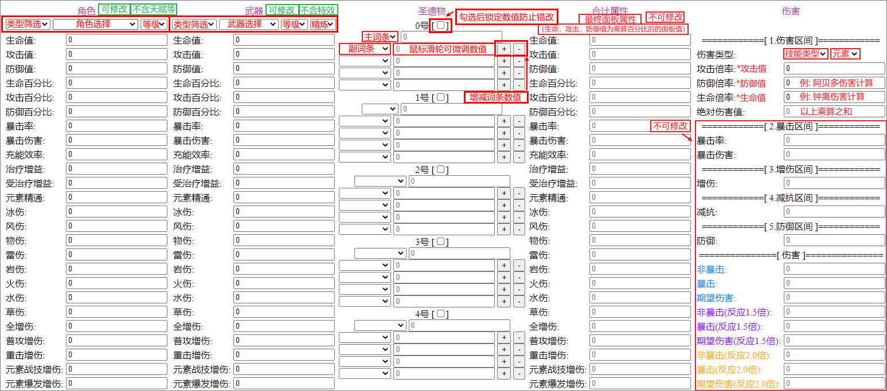
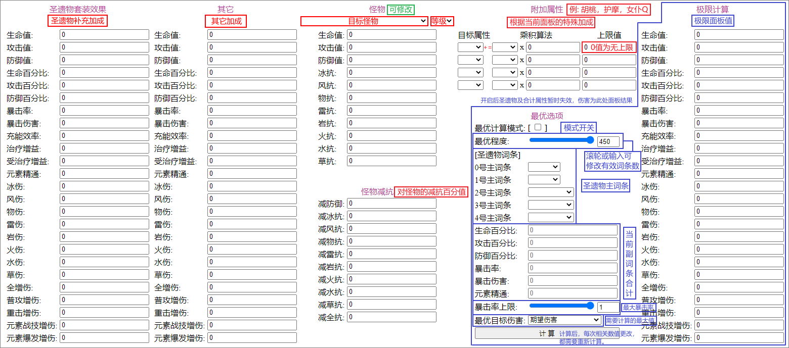

## [GenshinCal](https://genshin.pariya.cc/)

### 画面说明
  
  

### 操作说明
1. 选择`角色`及`等级` *(角色选择后，可以通过将鼠标停留在`角色`标题上以查看角色技能)*
2. 选择`武器`及`等级` *(武器及精炼等级选择后，可以通过将鼠标停留在`武器`标题上以查看当前特效)*
3. 填写`圣遗物`属性
4. 选择`怪物`及`等级`
5. 选择`伤害`各类及元素类型，并填入倍率
6. `圣遗物套装效果`，`其他`，`怪物减抗`，`附加属性`为选填